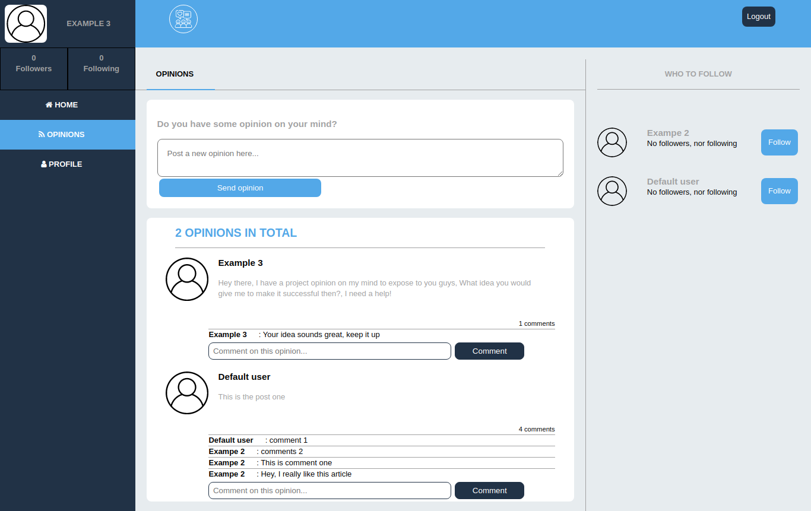
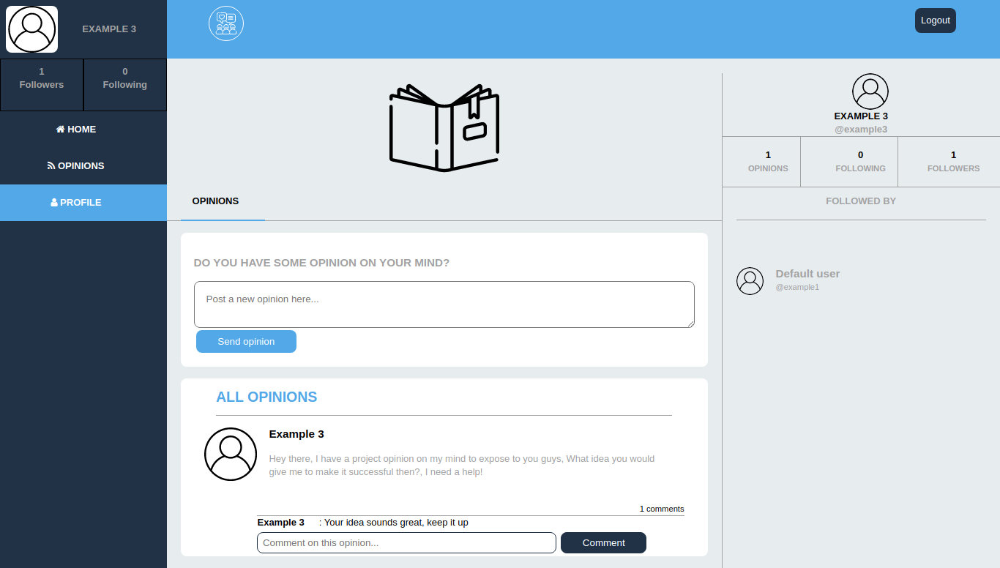

# Projects Opinions
    

## Project description
The [Projects Opinions](https://projects-opinions.herokuapp.com/) is an application which is available for anyone who has a project opinion to share, and other registered users will be able to comment on that opinion. I have listed all the [features](#Features) available on this app.

This project was done for learning purpose, the aim was to create a customized content but same design of [Twitter redesign](https://www.behance.net/gallery/14286087/Twitter-Redesign-of-UI-details) by [Gregoire Vella](https://www.behance.net/gregoirevella) in order to master Rails. This project is my capstone from [Microverse](https://www.microverse.org/), project specifications are listed [here](https://www.notion.so/Twitter-redesign-f8a8d48453d54d1a949bb0ceab4c8718)

## Screenshots
| Homepage && Opnions page | Profile page && User page |
| --- | --- |
|  |  |

## Project presentation
- [Click here](https://www.loom.com/share/79c2f2c45cc043b4abe2afac3183e7fa) to see me presenting this project.

## Built with
- [Ruby on rails 6.0.3.3](https://rubygems.org/gems/rails/versions/6.0.3.3)
- [SASS](https://sass-lang.com/)
- [PostgreSQL](https://www.postgresql.org/)

## Features
- User can sign up
- User can sign in
- User can follow other users
- User can unfollow other users
- User can see their followers
- User can post opinions
- User can comment on any opinion
- User can upload their profile picture and cover picture while signing up
- User can see other people's profile

## Deployment
[Projects Opinions on heroku](https://projects-opinions.herokuapp.com/)

## Tools
- [Git](https://git-scm.com/) for version control
- [RSpec](https://rspec.info/) for testing
- [Capybara](http://teamcapybara.github.io/capybara/) for integration tests
- [Travis CI](https://travis-ci.org/) for continuous integration
- [Simplecov](https://github.com/simplecov-ruby/simplecov) and [Coveralls](https://coveralls.io/) for counting and reporting code coverage
- [Stylelint](https://stylelint.io/) and [Rubocop](https://rubocop.org/) for code linting and formatting
- [Heroku](https://heroku.com/) for deployment

## Running and testing it locally

### Prerequisites
- [Ruby 2.7.1](https://www.ruby-lang.org/en/news/2020/03/31/ruby-2-7-1-released/)
- [Node v12.18.4 or higher](https://nodejs.org/en/)
- [Yarn v1.22.4 or higher](https://yarnpkg.com/)
- [Git 2.17.0 or higer](https://yarnpkg.com/)
- [Postgresql 9.5.23 or higer](https://www.postgresql.org/)

### Setup
- Run `git clone https://github.com/descholar-ceo/projects-opinions && cd projects-opinions` to get a copy of source codes on your local computer and to navigate inside the project directory
- Run `bundle install && yarn` to install gems and dependencies
- Run `bundle exec rake db:create` to create databases that are being used with this project
- Run `bundle exec rake db:migrate` to migrate (create) all of the tables needed by this project

### Usage
- Run `bin/rails server` to start the server, normally after the server started, you should be able to access the projects-opinion app on `http://localhost:3000` or `http://127.0.0.1:3000` or `http://0.0.0.0:3000` in your browser

### Tests
To run tests locally, run this command `bundle exec rspec`

## Contributions

There are two ways of contributing to this project:

1.  If you see something wrong or not working, please check [the issue tracker section](https://github.com/descholar-ceo/projects-opinions/issues ), if that problem you met is not in already opened issues then open a new issue by clicking on `new issue` button.

2.  If you have a solution to that, and you are willing to work on it, follow the below steps to contribute:
    1.  Fork this repository
    1.  Clone it on your local computer by running `git clone https://github.com/your-username/projects-opinions.git` __Replace *your username* with the username you use on github__
    1.  Open the cloned repository which appears as a folder on your local computer with your favorite code editor
    1.  Create a separate branch off the *develop branch*,
    1.  Write your codes which fix the issue you found
    1.  Commit and push the branch you created
    1.  Raise a pull request, comparing your new created branch with our original develop branch [here](https://github.com/descholar-ceo/projects-opinions)

## Author

👤 **Mugirase Emmanuel**

- Github: [@descholar-ceo](https://github.com/descholar-ceo)
- Twitter: [@descholar3](https://twitter.com/descholar3)
- Linkedin: [MUGIRASE Emmanuel](https://www.linkedin.com/in/mugirase-emmanuel)

## Show your support

Give a ⭐️ if you like this project!

## Acknowledgment
* [Microverse](https://www.microvese.org)

* [Gregoire Vella](https://www.behance.net/gregoirevella) for the design idea
